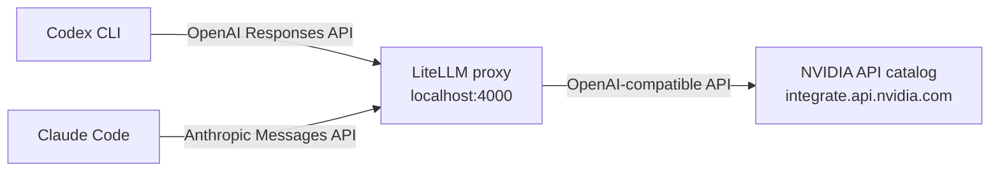

# nim-agent-proxy

Run coding agents such as [Codex CLI](https://github.com/openai/codex) and [Claude Code](https://docs.anthropic.com/en/docs/claude-code) against free models hosted on the [NVIDIA API catalog](https://build.nvidia.com), using a small local [LiteLLM](https://github.com/BerriAI/litellm) proxy to translate between the APIs.

> **Unofficial.** This project is not affiliated with or endorsed by OpenAI, Anthropic or NVIDIA. Check the terms and rate limits of the NVIDIA API catalog before relying on it.



The agents speak their own API. LiteLLM presents both locally and forwards the requests to whichever NVIDIA-hosted model you configure. The agent runs on your machine, only the model calls go to NVIDIA.

## Status

| Piece | State |
|---|---|
| Codex CLI via the PowerShell launcher (Windows) | Used regularly with `openai/gpt-oss-20b` |
| Claude Code launchers | **Experimental, not yet tested end to end** |
| Bash launchers (Linux / macOS) | **Experimental, not yet tested** |

These tools were designed around specific models. Open models vary a lot in tool-calling quality, so expect rougher results than with the official backends, especially with smaller models.

## Prerequisites

- Python 3.13 and [pipenv](https://pipenv.pypa.io)
- A free API key from [build.nvidia.com](https://build.nvidia.com)
- [Codex CLI](https://github.com/openai/codex) and/or [Claude Code](https://docs.anthropic.com/en/docs/claude-code), installed and on your `PATH`

## Setup

```bash
git clone https://github.com/<your-user>/nim-agent-proxy.git
cd nim-agent-proxy

pipenv install

cp .env.example .env      # then put your key in NVIDIA_API_KEY
```

## Use

Each launcher loads your key, starts the proxy in its own window, waits until it answers, starts the agent, and stops the proxy when the agent exits. Extra arguments are passed to the agent.

**Codex CLI**

```powershell
.\scripts\launch-codex.ps1          # Windows
```
```bash
./scripts/launch-codex.sh           # Linux / macOS
```

**Claude Code** (experimental)

```powershell
.\scripts\launch-claude.ps1         # Windows
```
```bash
./scripts/launch-claude.sh          # Linux / macOS
```

### Choosing a model

Edit `model:` in [litellm_config.yaml](litellm_config.yaml) to any chat model ID from the [NVIDIA catalog](https://build.nvidia.com), prefixed with `nvidia_nim/`. For tool-driven agents, choose a model that supports function calling. Restart the launcher after changing it.

### Using Codex in your own projects

Codex reads `.codex/config.toml` from the project you run it in. To use the proxy elsewhere, start it (`pipenv run litellm --config litellm_config.yaml --port 4000` from this repo), copy [.codex/config.toml](.codex/config.toml) into your project, and run `codex` there. Set `NVIDIA_API_KEY` to any value in that shell. The proxy holds the real key.

## How it works

- **Codex** is configured in [.codex/config.toml](.codex/config.toml) with a custom provider that points at `http://localhost:4000` and uses the Responses API (`wire_api = "responses"`).
- **Claude Code** is pointed at the proxy with environment variables set by the launcher: `ANTHROPIC_BASE_URL`, `ANTHROPIC_AUTH_TOKEN`, `ANTHROPIC_MODEL` and `ANTHROPIC_SMALL_FAST_MODEL`. They exist only in the launcher's process.
- **LiteLLM** receives the requests, maps the model name `nvidia-model` to the configured NVIDIA model, and forwards them with your real key. `drop_params: true` removes request parameters the NVIDIA endpoint rejects.
- The proxy listens only on your machine. Your NVIDIA key is read from `.env` (or the environment) and is never written into any config file.

## Troubleshooting

| Symptom | Likely cause |
|---|---|
| `.env file not found` / `NVIDIA_API_KEY is empty` | Copy `.env.example` to `.env` and set the key. |
| `Proxy did not answer ... within 120s` | Check the proxy window for errors. Common causes: `pipenv install` was not run, or port 4000 is in use. |
| Agent says the model is not found | `litellm_config.yaml` must keep `model_name: nvidia-model`, which the agents request. |
| 401 / 403 from NVIDIA | The API key is invalid or expired. |
| 429 from NVIDIA | You hit the free-tier rate limit. Wait, or choose another model. |
| Agent loops or ignores tools | The model's tool calling is weak. Try a larger model. |

## License

[MIT](LICENSE)
