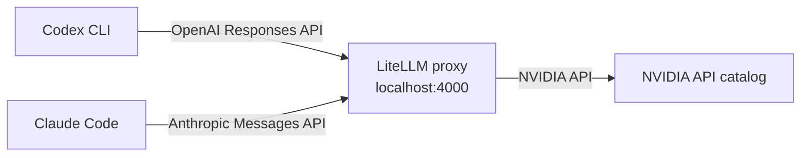

# nim-agent-proxy

Run coding agents such as [Codex CLI](https://github.com/openai/codex) and [Claude Code](https://docs.anthropic.com/en/docs/claude-code) against models hosted on the [NVIDIA API catalog](https://build.nvidia.com), using a small local [LiteLLM](https://github.com/BerriAI/litellm) proxy to translate between the APIs.

> **Unofficial.** This project is not affiliated with or endorsed by OpenAI, Anthropic or NVIDIA. Check each provider's terms and rate limits before relying on it.



The agents speak their own API. LiteLLM presents a local endpoint and forwards requests to the provider selected by the launcher. The agents run on your machine; model calls go to NVIDIA.


These tools were designed around specific models. Open models vary a lot in tool-calling quality, so expect rougher results than with the official backends, especially with smaller models.

## Prerequisites

- Python 3.13 and [pipenv](https://pipenv.pypa.io)
- Bash and `curl` for Linux / macOS launchers
- An API key from [NVIDIA](https://build.nvidia.com)
- [Codex CLI](https://github.com/openai/codex) and/or [Claude Code](https://docs.anthropic.com/en/docs/claude-code), installed and on your `PATH`

## Setup

```bash
git clone https://github.com/pourmoayed/nim-agent-proxy.git
cd nim-agent-proxy

pipenv install
```

Create `.env` from the template, then fill in `NVIDIA_API_KEY`:

```powershell
Copy-Item .env.example .env
```
```bash
cp .env.example .env
```

## Use

Each launcher loads the selected provider's key, starts its proxy on a provider-specific port, waits until it answers, starts the agent, and stops the proxy when the agent exits. Extra arguments are passed to the agent.

Run these commands yourself in a terminal, from the repository root (the `nim-agent-proxy` folder). The agent opens in that same terminal, and the proxy stops when you exit it.

| Agent | Windows (PowerShell) | Linux / macOS (Bash) |
|---|---|---|
| Codex CLI | `.\config\nvidiaAPI\launch-codex.ps1` | `bash ./config/nvidiaAPI/launch-codex.sh` |
| Claude Code | `.\config\nvidiaAPI\launch-claude.ps1` | `bash ./config/nvidiaAPI/launch-claude.sh` |

### Choosing a model

Edit `model:` in [config/nvidiaAPI/litellm_config.yaml](config/nvidiaAPI/litellm_config.yaml) to a model ID from the [NVIDIA catalog](https://build.nvidia.com), prefixed with `nvidia_nim/`. Choose a model that supports tool calling, and restart the launcher after changing it.

**Tested models.** These worked with both Claude Code and Codex when this project was tested. NVIDIA changes its catalog often, so availability and speed may differ later.

| Model | Notes |
|---|---|
| `nvidia/nemotron-3-ultra-550b-a55b` | Fast in Claude Code and works in Codex. |
| `nvidia/nemotron-3-super-120b-a12b` | Fast in Claude Code and works in Codex. |
| `openai/gpt-oss-20b` | Works in Claude Code and Codex. |

For example: `model: nvidia_nim/nvidia/nemotron-3-ultra-550b-a55b`.

### Codex model catalog

Codex only knows its built-in OpenAI models, so a custom model such as `nvidia-model` needs an entry in a model catalog. [.codex/config.toml](.codex/config.toml) points at one with `model_catalog_json = "model_catalog.json"`, and [.codex/model_catalog.json](.codex/model_catalog.json) defines the `nvidia-model` entry:

- `slug` must match `model` in `config.toml` and `model_name` in `litellm_config.yaml` (`nvidia-model`).
- `context_window` / `max_context_window` (131072) should match the context length of the NVIDIA model you chose. Lower them if the model has a smaller window.
- `supported_reasoning_levels`, `shell_type`, `apply_patch_tool_type` and the other fields tell Codex which features to use. Adjust them if your model handles tools or reasoning differently.
- `base_instructions` is the system prompt Codex sends.

If you copy `.codex/config.toml` into another project, copy `model_catalog.json` next to it.

### Claude Code settings in the PowerShell launcher

[launch-claude.ps1](config/nvidiaAPI/launch-claude.ps1) configures Claude Code in `Set-ClaudeCodeEnvironment`. The variables are set only for the launcher's process:

| Variable | Value | Purpose |
|---|---|---|
| `ANTHROPIC_BASE_URL` | `http://localhost:4000` | Sends requests to the local proxy instead of Anthropic. |
| `ANTHROPIC_AUTH_TOKEN` | `anything` | Placeholder. The proxy holds the real NVIDIA key. `ANTHROPIC_API_KEY` is removed so it can't take over. |
| `ANTHROPIC_MODEL`, `ANTHROPIC_SMALL_FAST_MODEL` | `nvidia-model` | Main and background model. |
| `ANTHROPIC_DEFAULT_OPUS_MODEL`, `..._SONNET_MODEL`, `..._HAIKU_MODEL` | `nvidia-model` | Maps every Claude model tier to the proxy alias. |
| `CLAUDE_CODE_MAX_CONTEXT_TOKENS` | `131072` | Context size Claude Code assumes. Match it to your model. |
| `CLAUDE_CODE_DISABLE_NONESSENTIAL_TRAFFIC` | `1` | Skips telemetry and update checks. |

To change the port, edit `$port` at the top of the script. It is used for both the proxy and `ANTHROPIC_BASE_URL`.

## How it works

- **Codex** is configured in [.codex/config.toml](.codex/config.toml) with a custom provider that points at `http://localhost:4000` and uses the Responses API (`wire_api = "responses"`).
- **Claude Code** is pointed at the proxy with environment variables set by the launcher: `ANTHROPIC_BASE_URL`, `ANTHROPIC_AUTH_TOKEN`, `ANTHROPIC_MODEL` and `ANTHROPIC_SMALL_FAST_MODEL`. They exist only in the launcher's process.
- **LiteLLM** receives the requests, maps the local model alias to the provider model configured in the matching config under `config/`, and forwards them with that provider's real key. `drop_params: true` removes unsupported request parameters it knows about, and `additional_drop_params` removes extra fields by name (Codex's `client_metadata`).
- The proxy listens only on your machine. Your NVIDIA key is read from `.env` (or the environment) and is never written into any config file.

## Troubleshooting

| Symptom | Likely cause |
|---|---|
| `.env file not found` / `NVIDIA_API_KEY is empty` | Copy `.env.example` to `.env` and set the key. |
| `Proxy did not answer ... within 120s` | Check the proxy window for errors. Common causes: `pipenv install` was not run, or port 4000 is in use. |
| Agent says the model is not found | `litellm_config.yaml` must keep `model_name: nvidia-model`, which the agents request. |
| 401 / 403 from NVIDIA | The API key is invalid or expired. |
| 429 from NVIDIA | You hit the free-tier rate limit. Wait, or choose another model. |
| Codex: `400 ... Unsupported parameter(s): client_metadata` | NIM rejects a field Codex adds to each request. `litellm_config.yaml` strips it with `additional_drop_params: ["client_metadata"]`. If NIM rejects another field, add its name to that list and restart. |
| Agent loops or ignores tools | The model's tool calling is weak. Try a larger model. |

## License

[MIT](LICENSE)
